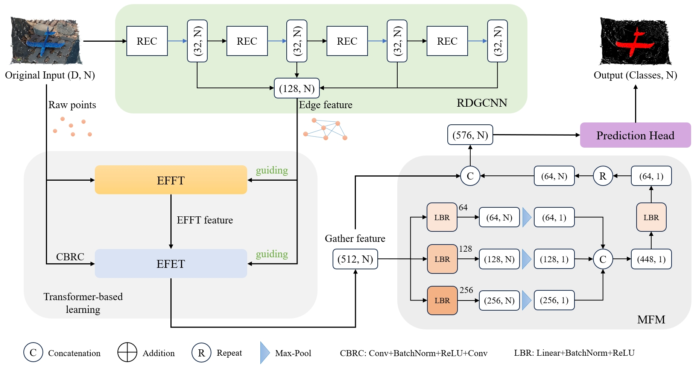

# EFGTNet: Edge Feature Guided Transformer Network for Point Cloud Salient Object Detection



---

## Dataset
The training and testing data is provided by [PCSOD](https://git.openi.org.cn/OpenDatasets/PCSOD-Dataset/datasets).

---

## Train
```bash
python train.py
```

## Evaluate
```bash
python test.py
```
You can directly obtain our visualization results from [here](), or download our pretrained model. The checkpoints can be found [here]().

---

Part of the code comes from previous work below, and we appreciate their contributions:
1. [Salient Object Detection for Point Clouds](https://git.openi.org.cn/OpenPointCloud/PCSOD)
2. [Point Transformer-Based Salient Object Detection Network for 3-D Measurement Point Clouds](https://github.com/ZeyongWei/PSOD-Net)
